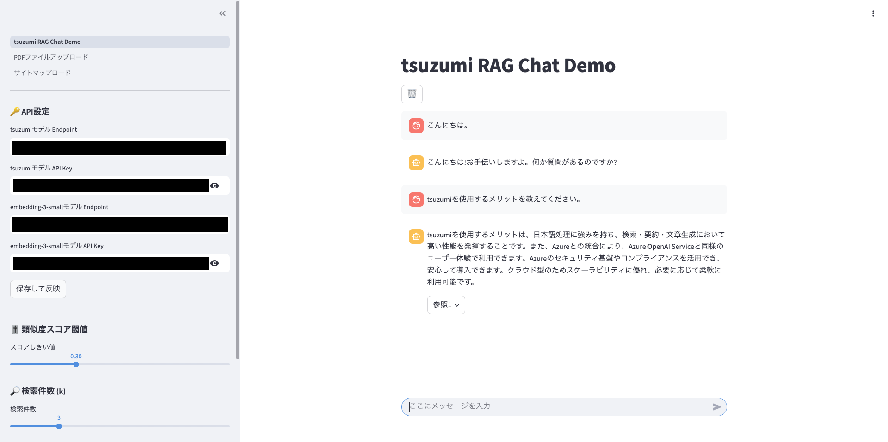
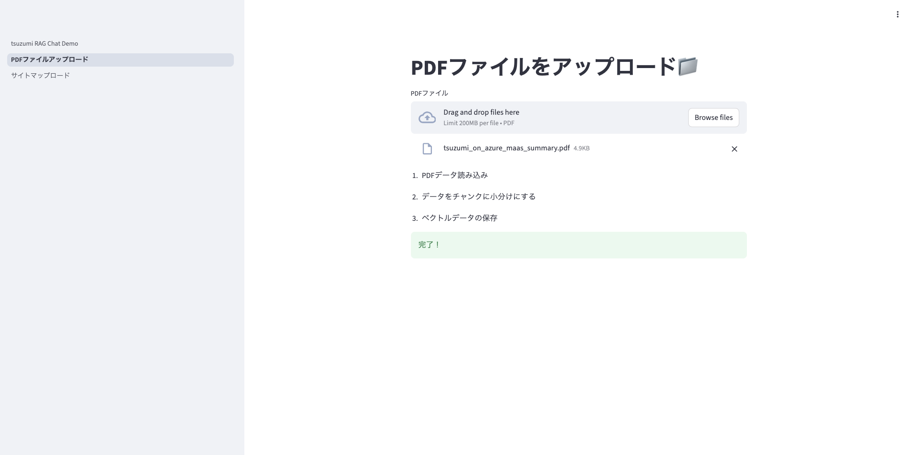
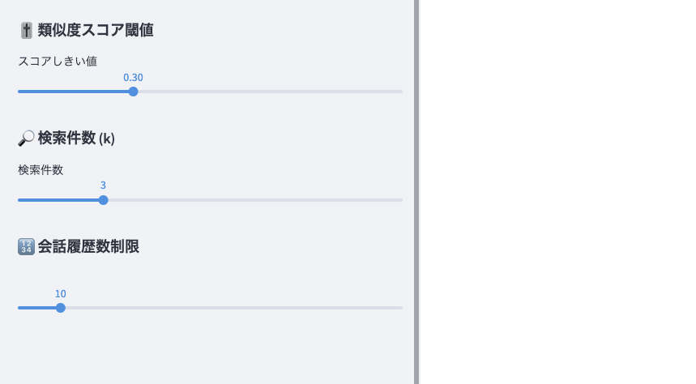

# tsuzumi RAG Chat Demo

Azure AI Foundry を通じて国産 LLM モデル tsuzumi を利用し、Streamlit と組み合わせて開発した RAG チャットアプリです。  
アップロードしたデータを検索・参照しながら、LLM が自然な対話応答を生成します。


## Purpose（開発目的）

このプロジェクトの主な目的は以下の通りです：

- 国産 LLM モデル tsuzumi を活用したアプリケーション開発を実践すること  
- RAG（Retrieval-Augmented Generation）の仕組みを理解すること  
- Docker や Azure Container Apps を用いて、クラウド環境でのアプリ構築経験を積むこと


## Features（機能）

- **国産 LLM モデル tsuzumi** を活用し、日本語に最適化された応答を生成  
- **RAG（Retrieval-Augmented Generation）** により、アップロードしたデータを検索・参照して文脈に沿った回答を生成  
- **FAISS を利用したベクトル検索**（類似度スコア閾値や検索件数を UI 側から調整可能）  
- **PDF / テキストデータのアップロード機能** に対応し、任意のドキュメントを検索対象に追加可能  
- **会話履歴数の制限機能** により、情報量とトークン使用量のバランスを調整  
- **Docker による環境構築**と **Azure Container Apps へのデプロイ**を想定した設計  
- **API 設定（エンドポイント・APIキー）の手動入力**とし、第三者が勝手にモデルを利用できないように工夫  
- **Streamlit ベースのシンプルな UI** により、ブラウザ上で直感的に利用可能


## Tech Stack（技術スタック）

- **Python 3.10** : アプリケーション全体の実装  
- **Streamlit** : チャット UI の構築  
- **tsuzumi（Azure AI Foundry）** : 応答生成に利用した国産 LLM  
- **FAISS** : ベクトル検索エンジン（RAG の検索部分を実装）  
- **LangChain** : LLM とベクトル検索を統合するフレームワーク  
- **Docker** : 開発環境のコンテナ化  
- **Azure Container Apps（予定）** : デプロイ先として利用予定


## Screenshots / Demo（画面キャプチャ）

以下は開発環境で動作させた際の画面キャプチャです。

### チャット画面


- アップロードした PDF に基づいて質問を入力  
- FAISS により関連する文書を検索  
- tsuzumi によって文脈に沿った回答を生成  
- 回答の下に参照元リンクを表示

### PDF アップロード画面


- ローカルファイルから PDF をアップロード可能  
- アップロードされた文書はベクトル化され、検索対象に追加される
- ※サイトマップローダーも作成しているが、非常に料金がかかるため使用できないようにしている

### 各種パラメータ設定画面


- 類似度スコアの閾値を調整可能  
- 検索件数（k値）を変更可能  
- 会話履歴数の上限を設定可能（情報量とトークン使用量のバランスを調整）


## Project Structure（プロジェクト構成）

```plaintext
.
├── app/                               # アプリ本体
│   ├── tsuzumi_RAG_Chat_Demo.py       # メインの Streamlit アプリ
│   └── pages/                         # マルチページ構成
│       ├── 1_PDFファイルアップロード.py  # PDF アップロード機能
│       └── 2_サイトマップロード.py       # サイトマップからデータ取得
├── src/
│   └── utils.py                       # データ処理・FAISS管理・Chain定義など
├── vector_store/                      # FAISS によるベクトルデータ保存先
├── requirements.txt                   # 依存ライブラリ
├── Dockerfile                         # コンテナ定義
├── README.md
└── LICENSE
```

## Future Work（今後の改善点）

- **tsuzumi モデルの回答精度の検証と向上**  
- **回答参照の出力改善**（現在は過去の回答参照が消えてしまう仕様を改良）  
- **データソースの拡張**（Web サイトやデータベースからの取得に対応）  
- **UI/UX の改善**（より高度な Python フレームワークを利用によるユーザー体験の向上）


## Notes（補足）

参考：Udemy 講座「Azure OpenAI Service で作る Chat アプリ」

ただし、以下の点については独自に拡張・変更を行っています：
- **国産 LLM モデル tsuzumi** を利用（Azure AI Foundry）  
- **Docker を利用した環境構築**  
- **Azure Container Apps へのデプロイ**（予定）  
- **API 設定（エンドポイント・APIキー）の手動入力** によるセキュリティ対策  
- **例外処理の追加**（ベクトルDBが存在しない場合のエラーメッセージ表示 など）  
etc...


## License（ライセンス）

This project is licensed under the MIT License - see the [LICENSE](./LICENSE) file for details.

